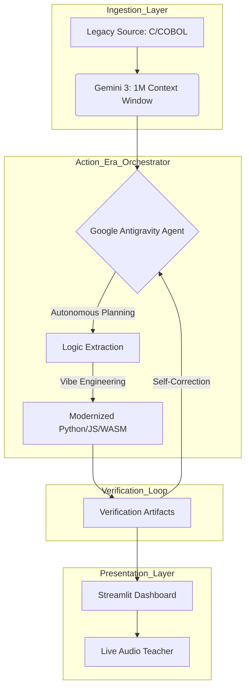

# 🏛️ Gemini Rosetta: Legacy Modernization Orchestrator
**Bridging the gap between 1990s legacy logic and 2026 autonomous infrastructure using the Gemini 3 family.**

## 🌟 Overview
Gemini Rosetta is an autonomous engineering ecosystem designed to modernize legacy codebases. By leveraging **Gemini 3’s 1M+ token context window**, the system natively reasons over entire repositories—starting with the legendary 1993 **DOOM engine** and extending to critical **Legacy Bank (COBOL)** infrastructures.

Unlike simple prompt-wrappers, Gemini Rosetta is a robust **orchestrator** that plans, executes, and verifies code modernization in a closed loop using **Google Antigravity**.

## 🚀 Strategic Tracks & Features

### 🧠 The Marathon Agent (Autonomous Continuity)
Our agent operates over long-running tasks without human supervision.
- **Thought Signatures:** The agent maintains continuity by logging its multi-step reasoning levels during complex migrations.
- **Self-Correction:** It autonomously identifies and patches logic gaps between legacy C/COBOL and modern Python/JS.

### ☯️ Vibe Engineering (Autonomous Verification)
We move beyond code generation to **code verification**.
- **Verification Artifacts:** Every modernization step generates a browser-based artifact to prove functional parity.
- **Testing Loops:** Automated unit tests verify that modern outputs match legacy logic exactly.

### 👨‍🏫 The Real-Time Teacher (Multimodal Guidance)
Using the **Gemini Live API**, Gemini Rosetta provides real-time audio-visual feedback.
- **Adaptive Learning:** The AI teacher explains complex spatial-temporal logic (like DOOM’s physics) or financial vulnerabilities in real-time.

---

## 🏗️ System Architecture

---

## 🏛️ Enterprise Impact: Bank Migration Lab
**Gemini Rosetta addresses a trilyon-dollar problem: Legacy Debt.**

- **Problem:** Global financial systems rely on 50-year-old COBOL code.
- **Solution:** Rosetta uses multimodal reasoning to transform brittle financial logic into secure, modern microservices while patching security vulnerabilities.

The interest calculation modernization follows high-precision financial models:
$$A = P(1 + \frac{r}{n})^{nt}$$

---

## 🛠️ Technical Implementation
- **Model:** Gemini 3 Pro (Action Era Orchestrator).
- **Environment:** Google Antigravity for autonomous file and terminal access.
- **Frontend:** Streamlit with Web Audio API for spatial-temporal visualization.
- **Audio:** Gemini Live API for real-time synthesis.

## 🏆 Hackathon Submission Details
- **Project Name:** Gemini Rosetta
- **Tracks:** Marathon Agent, Vibe Engineering, Real-Time Teacher
- **Deadline:** February 10, 2026
- **Prize Goal:** $50,000 Grand Prize & AI Futures Fund interview
