# Gemini Rosetta: Project Architecture

```mermaid
graph TD
    subgraph "Legacy Realm (1993)"
        style Legacy Realm fill:#222,stroke:#f00,stroke-width:2px
        LE[p_enemy.c] -->|Analysis| P1(Logic Extraction)
        LS[s_sound.c] -->|Analysis| P2(Algorithm Extraction)
        LM[p_mobj.c] -->|Analysis| P3(Physics Extraction)
    end

    subgraph "Transformation Pipeline"
        style Transformation Pipeline fill:#333,stroke:#ff0,stroke-width:2px,stroke-dasharray: 5 5
        P1 -->|Refactoring| MAI[Behavior Tree Impl]
        P2 -->|Porting| MAU[Web Audio API Impl]
        P3 -->|Simulating| MPH[Newtonian Physics Impl]
    end

    subgraph "Modern Realm (2026)"
        style Modern Realm fill:#0f0f0f,stroke:#0f0,stroke-width:2px
        MAI -->|Code| PY_AI[modern_ai_prototype.py]
        MAU -->|Code| JS_AU[audio_engine.js]
        MPH -->|Code| PY_PH[modern_physics.py]
        
        PY_AI -->|Verify| T_AI[test_ai_prototype.py]
        PY_PH -->|Verify| T_PH[test_physics.py]
        JS_AU -->|Visuals| V_AU[audio_visualizer.html]
    end

    subgraph "Control Center"
        style Control Center fill:#111,stroke:#00f,stroke-width:4px
        DASH[dashboard.py]
        DASH -->|Executes| T_AI
        DASH -->|Executes| T_PH
        DASH -->|Embeds| V_AU
        DASH -->|Displays| PY_AI
        DASH -->|Displays| PY_PH
    end
```

## Legend
- **Legacy Realm**: Original DOOM source code (C Language).
- **Transformation Pipeline**: The "Archeology" process performed by the Agent.
- **Modern Realm**: The resulting modern implementations (Python/JavaScript).
- **Control Center**: The Streamlit Dashboard acting as the central interface for users.
